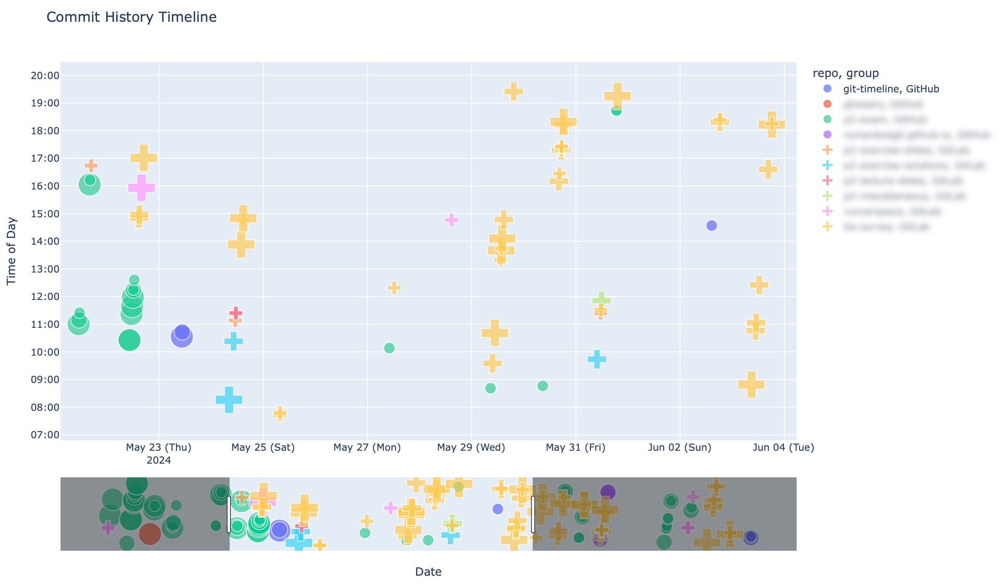

# Git Timeline

Visualizes commits of multiple repositories at once.



## Setup

```bash
pip install -r requirements.txt
cp config.json.template config.json
```

## Usage

```bash
python gittimeline.py
```

Use a different config file with:

```bash
python gittimeline.py --config path/to/config.json
```

The script writes `commit_history_timeline.html` and opens it in the configured
browser.

## Configuration

Copy `config.json.template` to `config.json` and edit the local copy.
`config.json` is ignored by git so personal paths, browsers, and committer
patterns stay local.

```json
{
  "base_dirs": ["~/Documents/GitLab", "~/Documents/GitHub"],
  "branches": ["_all_"],
  "committers": ["(?i).*example.com"],
  "days": 45,
  "start_hour": 5,
  "end_hour": 22,
  "browser": "safari"
}
```

- `base_dirs`: directories that are recursively scanned for git repositories.
- `branches`: local branches to include. Use `"_all_"` or `["_all_"]` to include
  every local branch in each repository.
- `committers`: regular expressions matched against committer email addresses.
- `days`: how far back to scan.
- `start_hour` / `end_hour`: optional inclusive hour filter. Defaults to `5`
  through `22`.
- `browser`: browser name passed to Python's `webbrowser` module.
